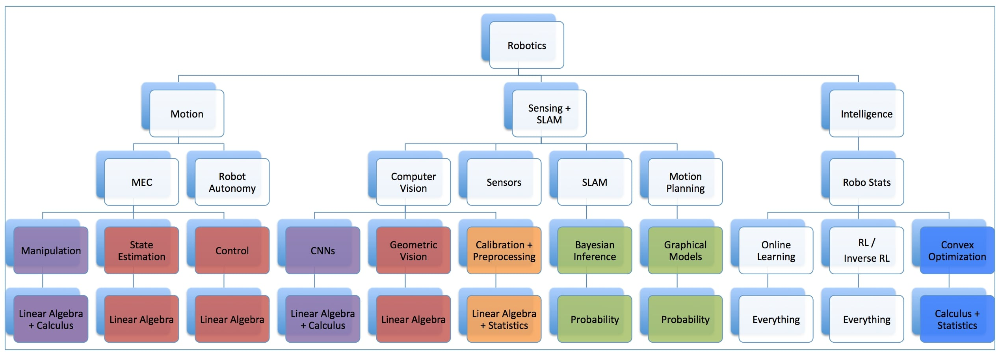

# 16-642-Manipulation-Estimation-and-Control

### Where this all fits in the field of robotics:

### Mathematical Requirements:
- Linear Algebra
- Calculus

### This allows you to:

#### In regular english:
- Apply methods and ideas for robotic manipulation, state estimation, control 

#### More specifically:
- Simulate and analyze dynamic behavior of physical systems through ODE and difference equations.
- Derive transfer function representation of linear systems from ODE and difference equations using Laplace and z transforms.
- Predict qualitative and quantitative behavior of continuous and discrete time linear systems by examining transfer function poles.
- Derive transfer function of systems composed of multiple component linear systems combined in series, parallel, and feedback config.
- Synthesize PID feedback controllers to achieve desired step-response characteristics.
- Analyze transient behavior of linear and nonlinear state-space systems via eigenvalues and Lyapunov theory.
- Construct state feedback controllers and state observers for linear state space systems via pole placement and linear quadratic regulator.
- Understand the Kalman filter equations, and implement extended Kalman filter for robotic state estimation and SLAM.
- Understand pose graph estimation techniques, and implement them for problems such as SLAM and vision-based odometry.
